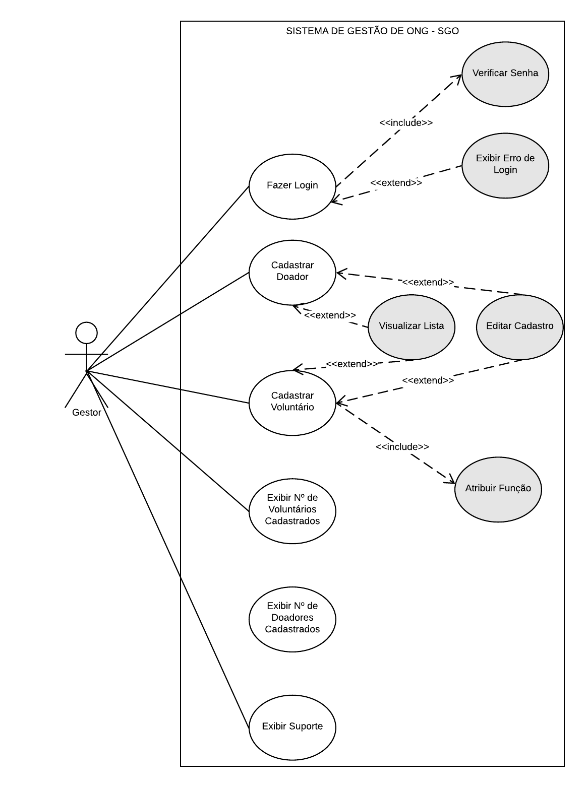

# Especificações do Projeto

Por meio da técnica de observação e brainstorming foram analisadas as necessidades dos usuários do sistema de forma a atender suas demandas.

A partir das informações coletadas, foram determinadas as personas e histórias de usuários que serão de suma importância para a definição das funcionalidades.

## Personas

As personas, ou seja, os usuários ideais do site foram definidos abaixo:

José

* 62 anos, mora na Boa Vista, Recife (PE);
* Trabalhava como professor e, atualmente, está aposentado;
* Utiliza poucos recursos do computador e é um pouco leigo com a tecnologia;
* Usava uma folha de papel para registrar os nomes dos voluntários e dos doadores;
* Fundou a ONG Domingo Solidário.

Maria

* 57 anos, esposa de José;
* Dona de casa;
* Dedica-se aos trabalhos voluntários há muitos anos;
* Sempre pensou que seria mais prático cadastrar os voluntários e doadores em um sistema de gestão;
* Deveria ser algo prático e simples pois José usaria também.

## Histórias de Usuários

Com a observação do cotidiano das personas e a compreensão de suas necessidades, foram definidas as seguintes histórias de usuários.

|EU COMO... `PERSONA`| QUERO/PRECISO ... `FUNCIONALIDADE` |PARA ... `MOTIVO/VALOR`                 |
|--------------------|------------------------------------|----------------------------------------|
|José                | Cadastrar os voluntários no sistema| Ter uma melhor organização no dia da ação. |
|Maria               | Ter a opção de colocar a função do voluntário na hora do cadastro| facilitar a gestão dos voluntários no planejamento das ações da ONG. |
|José                | Cadastrar os doadores no sistema | Fazer contato com os doadores antes da ação.  |
|Maria               | Visualizar, em forma de lista, os voluntários com as suas respectivas informações de contato | Facilitar a gestão dos voluntários no planejamento das ações da ONG. |
|José                | Ter uma opção de contato com o suporte | Poder entrar em contato no caso de algum problema com o sistema. |
|José                | Editar a função do voluntário | Para caso alguém queira trocar de função. |
|Maria               | Editar a disponibilidade do voluntário de acordo com o mês vigente.   | Nem todos voluntários tem disponibilidade todos os meses. |
|José                | Editar as informações de cadastro de doadores e voluntários |  Caso a pessoa mude de telefone ou E-mail, por exemplo. |
|Maria               | Excluir voluntários ou doadores do sistema  |  Caso a pessoa não queira mais contribuir com a ONG.  |
|José                | Visualizar, em forma de lista, os doadores com as suas respectivas informações de contato  | fazer contato com os doadores antes da ação.  |
|José                | Visualizar a quantidade de voluntários e doadores cadastrados na home | Melhorar a gestão da ONG. |

## Requisitos do Projeto

No projeto, sua estrutura e suas funções são determinadas a partir dos requisitos funcionais e não-funcionais.

Os requisitos funcionais podem ser definidos como a descrição das funções que os usuários poderão utilizar para satisfazer suas necessidades. Já os requisitos não funcionais são aqueles que descrevem as características de usabilidade e outros aspectos que o site necessita apresentar de maneira geral.

Portanto, com os estudos das personas e histórias dos usuários identificadas para o projeto, foram definidos os seguintes requisitos.

### Requisitos Funcionais

Os requisitos funcionais do projeto e seus respectivos níveis de prioridade de entrega são apresentados na tabela a seguir.

|ID    | Descrição do Requisito  | Prioridade |
|------|-----------------------------------------|----|
|RF-01| O sistema deve ter uma tela para o gestor realizar login, com os seguintes campos de preenchimento: E-mail e senha.  | ALTA |
|RF-02| O sistema deve ter uma tela de home com a opção de cadastro de voluntários e doadores. | ALTA |
|RF-03| A tela de home deve ter um botão para acessar a lista de voluntários e a lista de doadores cadastrados.    | ALTA |
|RF-04| O site deve conter, no momento do cadastro dos voluntários, os campos para preenchimento: Nome, Telefone, E-mail, disponibilidade para atuação no mês e função a qual o voluntário deseja no dia da ação: montagem ou distribuição.   | ALTA |
|RF-05| A lista de voluntários é formada pelos campos preenchidos no cadastro dos voluntários e conterá um botão para edição, exclusão e visualização dos detalhes dos dados cadastrados.    | MÉDIA |
|RF-06| O sistema deve permitir ao gestor alterar os dados cadastrais do voluntário.     | BAIXA |
|RF-07| O sistema deve permitir ao gestor excluir o voluntário cadastrado.     | BAIXA |
|RF-08| A tela de cadastro de doadores deve conter os seguintes campos para preenchimento: Nome, Telefone e E-mail.      | ALTA |
|RF-09| A lista de doadores é formada pelos campos preenchidos no cadastro dos doadores e conterá um botão para edição, exclusão e visualização dos detalhes dos dados cadastrados.     | MÉDIA |
|RF-10| O sistema deve permitir ao gestor alterar os dados cadastrais do doador.      | BAIXA |
|RF-11| O sistema deve permitir ao gestor excluir o doador cadastrado.     | BAIXA |
|RF-12| O sistema deve ter uma tela com opções para contactar o suporte técnico.       | BAIXA |
|RF-13| O site deve ter em sua home a quantidade de voluntários e doadores cadastrados.     | MÉDIA |

### Requisitos não Funcionais

Os requisitos não funcionais que a equipe deverá seguir durante o desenvolvimento, como também seus respectivos níveis de prioridade de entrega são apresentados na tabela a seguir.

|ID     | Descrição do Requisito  |Prioridade |
|-------|-------------------------|----|
|RNF-01| O site será responsivo, permitindo seu acesso e visualização em desktop e celulares. | ALTA |
|RNF-02| O site deverá ter uma disponibilidade 24/7. | ALTA |
|RNF-03| O site deve ser compatível com os principais navegadores do mercado (Google Chrome, Firefox, Opera). | ALTA |
|RNF-04| A interface deve ser agradável, intuitiva, de fácil utilização para o usuário e deve ser organizado de tal maneira que os erros dos usuários sejam minimizados. | MÉDIA |
|RNF-05| O site deve ser publicado em um ambiente acessível publicamente na Internet (GitHub Pages). | ALTA |
|RNF-06| O sistema deverá retornar ao usuário mensagem ao término de uma tarefa. | MÉDIA |
|RNF-07| Os formulários devem informar ao usuário quais são os campos de preenchimento obrigatório.  | MÉDIA |
|RNF-08| Utilizar símbolo e ícone para ajudar no entendimento e conseguir uma associação imediata sobre aplicações de reconhecimento.  | MÉDIA |
|RNF-09| A aplicação ou parte dela deve ser acessível por pessoas com certo tipo de deficiência ou outra necessidade específica.  | ALTA |

## Restrições

A tabela a seguir apresenta as condições que limitam a execução desse projeto.

|ID| Restrição                                             |
|--|-------------------------------------------------------|
|RE-01| O projeto deve ser entregue até dia 11/12/2022. |
|RE-02| A equipe não pode contratar terceiros para o desenvolvimento do projeto.        |
|RE-03| O site deve ser desenvolvido utilizando linguagens de programação Web para front-end, mais especificamente HTML, CSS e JavaScript e C#, bem como o framework ASP.NET.        |

## Diagrama de Casos de Uso

Os diagramas são utilizados na documentação e modelagem dos sistemas e de suas funcionalidades, de modo geral, podemos dizer que são essenciais para a construção de um software coeso.

Em linhas gerais, o diagrama de casos de uso documenta o que o sistema deve fazer do ponto de vista de quem o utiliza, dessa forma, ele apresenta as principais funcionalidades do sistema e a interação dessas com os usuários.

O diagrama a seguir diz respeito ao projeto em questão:

