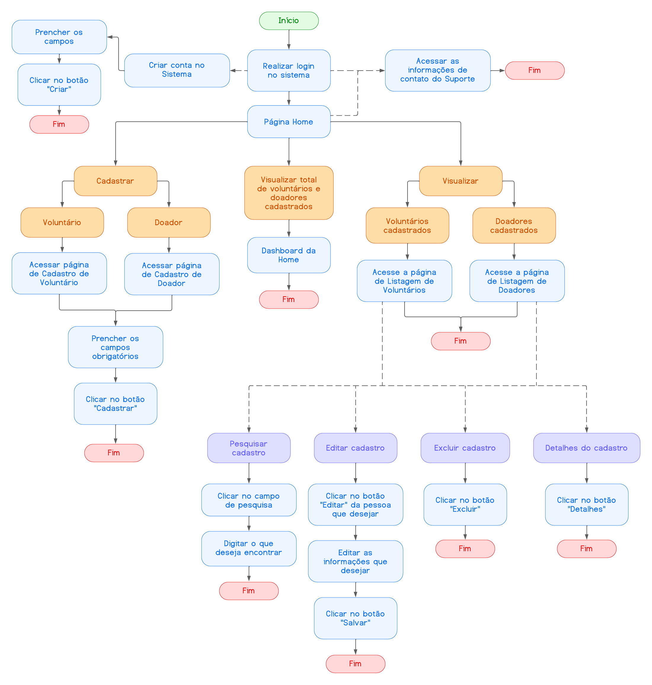

# Projeto de Interface

O detalhamento da interface do sistema levou em consideração questões como acessibilidade, usabilidade e agilidade. Assim sendo, o projeto possui uma identidade padronizada em todas as telas e foram projetadas para permitir a navegabilidade em desktops e dispositivos móveis.

## Diagrama de Fluxo

O diagrama de fluxo apresentado a seguir, demonstramos com detalhes o fluxo para cada ação desejada pelo gestor após realizar o login.

## Wireframes

Cada uma das telas representadas nos fluxos será detalhada nos itens que seguem. [Clicando aqui](https://www.figma.com/proto/0OKbr2snkURSE7kFsZv5cV/SGO---Sistema-de-Gest%C3%A3o-de-ONGs?page-id=0%3A1&node-id=138%3A2&viewport=-695%2C308%2C0.25&scaling=min-zoom&starting-point-node-id=138%3A2), é possível acessar o Wireframe Interativo criado na plataforma Figma.

Todas as telas do sistema possuem uma estrutura padrão comum. Nesta estrutura, existem três grandes blocos descritos a seguir:

**Cabeçalho:** local onde são dispostos elementos fixos de identidade (logo) e navegação principal do site (menu “hamburguer”);
**Conteúdo:** apresenta o conteúdo da tela em questão;
**Rodapé:** apresenta informações sobre a equipe de desenvolvimento.

- Login

A tela de login contém, no bloco de Cabeçalho, a logo do sistema e a logo da ONG Domingo Solidário.

Já no bloco de Conteúdo, ela conta com dois campos onde o gestor informa seu e-mail e senha de acesso, além do botão “Acessar” para realizar o login e ter acesso ao sistema.

E finalmente, no bloco de Rodapé, possuí o botão “Suporte”.

- Home

A tela home contém, no bloco de Conteúdo, as informações de quantidade total de voluntários e quantidade total de doadores cadastrados no sistema. Além disso, possui os botões de acesso ao “Cadastro de Voluntário”, “Cadastro de Doador”, “Listagem de Voluntários” e a “Listagem de Doadores”.

O bloco de Cabeçalho possui a logo do sistema, a opção de “Sair” e o menu “hamburguer” que dá acesso a barra de navegação na lateral esquerda, sobrepondo a tela. Nele é possível acessar os links de navegação para as páginas “Home”, “Cadastro de Voluntário”, “Listagem de Voluntários”, “Cadastro de Doador”, “Listagem de Doadores”, “Suporte” e a opção “Sair”.

Já no bloco de Rodapé, constam as informações sobre a equipe e a logo da PUC Minas.

- Cadastro de Voluntários

A tela de Cadastro de Voluntários contém, no bloco de Conteúdo, os campos de preenchimento “Nome”, “E-mail”, “Telefone” e as caixas de seleção “Função” (com as opções “Montagem” e “Distribuição”) e “Disponível esse Mês” (com as opções “Sim” e “Não”). Após o preenchimento de todas as informações obrigatórias o botão “Cadastrar” ficará ativo.

Os blocos de Cabeçalho e Rodapé possuem os mesmos elementos da Home.

- Lista de Voluntários

A tela da Lista de Voluntários contém, no bloco de Conteúdo, uma tabela com cada um dos voluntários cadastrados no sistema separados em linha e seus respectivos dados: “Nome”, “Telefone”, “E-mail”, “Função” e “Disponível esse Mês”, separados em colunas. Além disso, cada cadastro terá a opção “Editar”.

Ao clicar em “Editar”, será aberta uma tela que sobrepõe a lista de Voluntários contendo os campos “Nome”, “E-mail”, “Telefone” e as caixas de seleção “Função” (com as opções “Montagem” e “Distribuição”) e “Disponível esse Mês” (com as opções “Sim” e “Não”) para serem editadas. Além disso, terá a botão “Salvar”, “Excluir” e o “X” para fechar a tela.

Os blocos de Cabeçalho e Rodapé possuem os mesmos elementos da Home.

- Cadastro de Doadores

A tela de Cadastro de Doadores contém, no Bloco de Conteúdo, os campos de preenchimento “Nome”, “E-mail”, “Telefone”. Após o preenchimento de todas as informações obrigatórias o botão “Cadastrar” ficará ativo.

Os blocos de Cabeçalho e Rodapé possuem os mesmos elementos da Home.

- Lista de Doadores

A tela da Lista de Doadores contém, no bloco de Conteúdo, uma tabela com cada um dos doadores cadastrados no sistema separados em linha e seus respectivos dados: “Nome”, “Telefone” e “E-mail” separados em colunas. Além disso, cada cadastro terá a opção “Editar”.

Ao clicar em “Editar”, será aberta uma tela que sobrepõe a lista de Doadores contendo os campos “Nome”, “E-mail”, “Telefone”. Além disso, terá a botão “Salvar”, “Excluir” e o “X” para fechar a tela.

Os blocos de Cabeçalho e Rodapé possuem os mesmos elementos da Home.

- Suporte

A tela de Suporte possui, no bloco de Cabeçalho, somente a logo do sistema. No bloco de Conteúdo constam as informações de contato “Telefone”, “WhatsApp” e “E-mail” do Suporte Técnico.

Já o bloco de Rodapé possui os mesmos elementos da Home.

