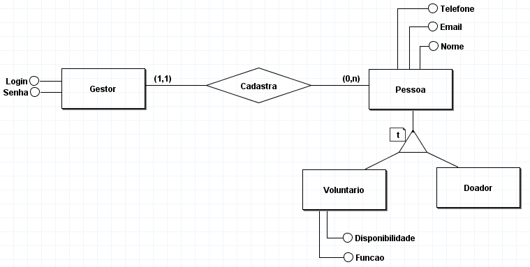

# Arquitetura da Solução

A arquitetura de solução é responsável por construir e implementar soluções com base nas necessidades do negócio. Pensando nisso, esta seção é composta dos detalhes técnicos, dos componentes e do ambiente de hospedagem que serão utilizados no projeto.

## Diagrama de Classes

Os diagramas de classes estão entre os tipos mais úteis de diagramas UML, pois mapeiam de forma clara e ilustrada a estrutura de um determinado sistema ao modelar suas classes, atributos, operações e relações entre objetos.

No caso do projeto SGO - Sistema de Gestão de ONGs, com base no diagrama de fluxo, criaremos 4 classes: Gestor, Público, Voluntários e Doadores. A classe Gestor terá como atributos o login e senha, e a classe verificará os valores de entrada para validação e ter acesso ao sistema. Utilizaremos herança, e temos como superclasse Público, e como subclasses Voluntários e Doadores. A subclasse Voluntários irá herdar todos os atributos e métodos da classe pai e também terá seus próprios atributos e métodos, assim como a subclasse Doadores, mas possuindo apenas todos os atributos e métodos da classe pai, definindo o seu comportamento. O gestor poderá ter nenhum ou muitos voluntários e doares, e os voluntários e doares terão apena um gestor. Dessa forma, iremos reduzir consideravelmente a quantidade de códigos e tornar a manutenção dos mesmos mais eficaz.

## Modelo ER (Projeto Conceitual)

O modelo ER proposto representa através de um diagrama como as entidades Gestor e Pessoa (voluntário ou doador) se relacionam entre si na aplicação interativa. Assim através do diagrama é possível observar que a entidade Gestor possui os atributos login e senha, e tem a função de cadastrar as instâncias da entidade Pessoa, sendo essa uma superclasse que possui os atributos e métodos em comum das classes Voluntário e Doador em uma relação de compartilhamento total. Vale ressaltar que a entidade Voluntário possui dois atributos a mais em relação a Doador, sendo estes a disponibilidade e a função. Além disso a cardinalidade do sistema entre as entidades principais é um para zero ou muitos, ou seja, um Gestor pode cadastrar nenhuma ou muitas Pessoas.

## Projeto da Base de Dados

Para o projeto da base de dados foram representadas todas as tabelas que serão armazenadas no banco, bem como suas respectivas colunas e tipo de dados, baseando-se nas entidades e relacionamentos identificados no Modelo ER. Para o modelo proposto não foi identificado a necessidade do uso de chaves primárias e estrangeiras, considerando que cada tabela contém todas as informações referentes a determinada entidade, assim não seria necessário referenciar outras tabelas como complemento de informações.

## Tecnologias Utilizadas

Para a implementação da solução o grupo fez uso de algumas tecnologias, tal como o Visual Studio, editor de código-fonte - também conhecido como IDE de desenvolvimento. Além disso, a equipe faz uso da ferramenta de comunicação da Microsoft, o Teams, onde acontecem as reuniões com a orientadora do projeto. Para armazenamento dos arquivos do projeto, definimos o OneDrive, serviço de armazenamento em nuvem da Microsoft, como ferramenta a ser utilizada. 

Para a criação dos wireframes e protótipos foi escolhida a plataforma Figma por se tratar de uma ferramenta de design para interfaces com possibilidade de trabalho colaborativo.  

O GitHub também está sendo utilizado por se tratar de um serviço baseado em nuvem e que hospeda um sistema de controle de versão. A plataforma também é utilizada para gerenciamento do projeto. Usamos a aba “projects” para monitorar o andamento do projeto em um quadro modelo Kanban. 

Como serviço de hospedagem e banco de dados da nossa aplicação será utilizado o Azure, plataforma da Microsoft que possui uma série de serviços em nuvem. 

## Hospedagem

O site do projeto utiliza a plataforma Microsoft Azure como serviço de hospedagem. O site pode ser acessado [aqui](https://sgoproject.azurewebsites.net).

