# Template Padrão da Aplicação

O template padrão do site vai seguir a estrutura do Wireframe elaborado na seção anterior, sendo composto pelas seguintes telas: 

- Login 

A tela a seguir tem como objetivo permitir ao gestor a realização de login para acesso ao sistema, além de proporcionar acesso à tela de suporte. Para isso, deverá informar e-mail e senha e clicar no botão “acessar”.  Ao realizar o login, será redirecionado para a home. 

- Home

Essa é a primeira tela que o gestor acessa após realizar seu login. É a tela que contém as principais funcionalidades do sistema, com opções de cadastro de voluntários e doadores, visualização da quantidade total de voluntários e doadores cadastrados no sistema, bem como opção de acesso às listas de cadastro e a opção “sair”. 

A tela também conta com menu lateral, onde o gestor pode acessar, além das opções anteriormente descritas, o suporte do sistema.  

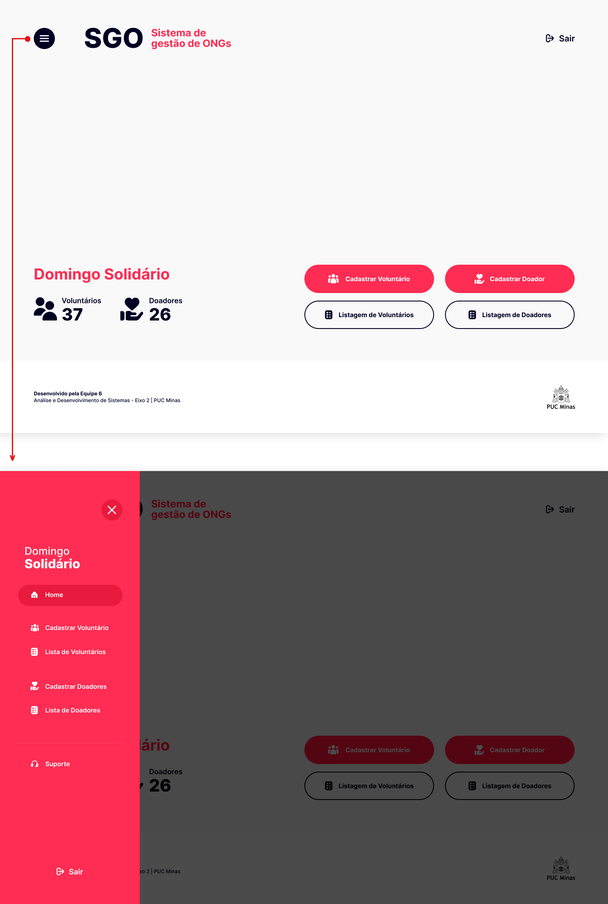

- Cadastro de Voluntários

Essa tela permite ao gestor realizar o cadastro de um voluntário. Para isso, ele deverá preencher os campos com as informações requisitadas e clicar em “cadastrar”. 

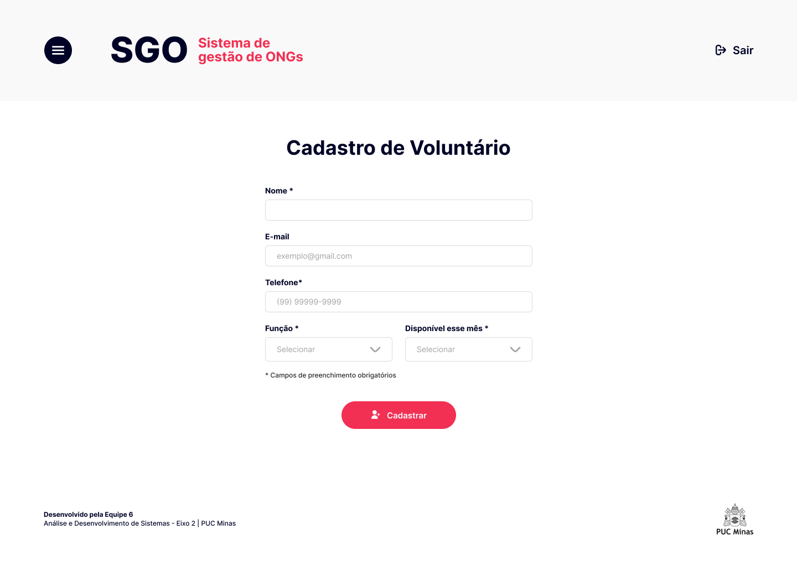

- Lista de Voluntários

Feito o cadastro, o gestor poderá visualizar o voluntário e suas informações (como telefone, e-mail, função e disponibilidade) em uma lista. Esse é o objetivo da tela abaixo, que também conta com botões para edição, exclusão e visualização de detalhes do cadastro do respectivo voluntário. 

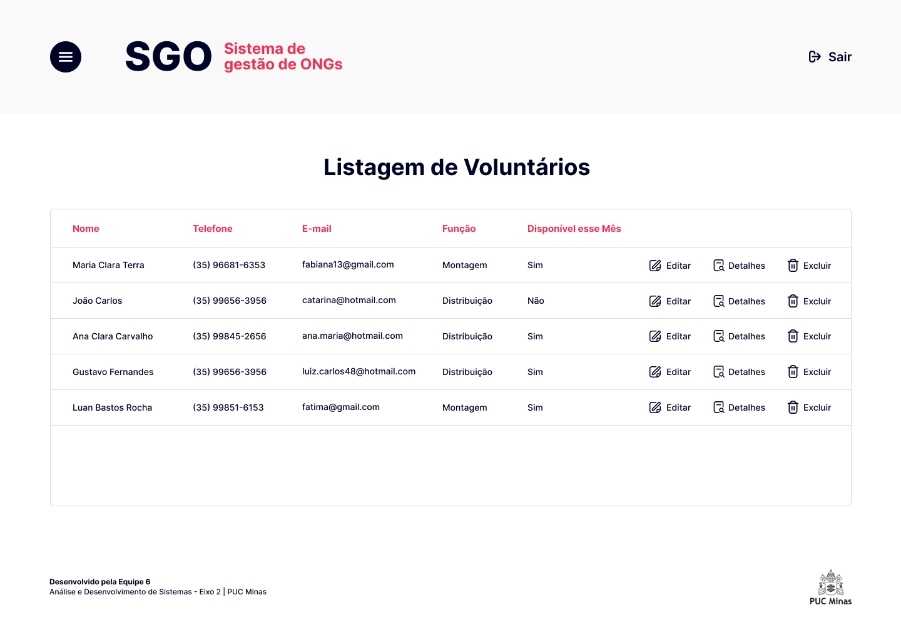

- Editar cadastro do Voluntário

Essa tela permite ao gestor a realização da edição do cadastro de um voluntário. Para isso, ele deverá preencher os campos e clicar em salvar.  Caso queira desistir, basta clicar em “voltar”. 

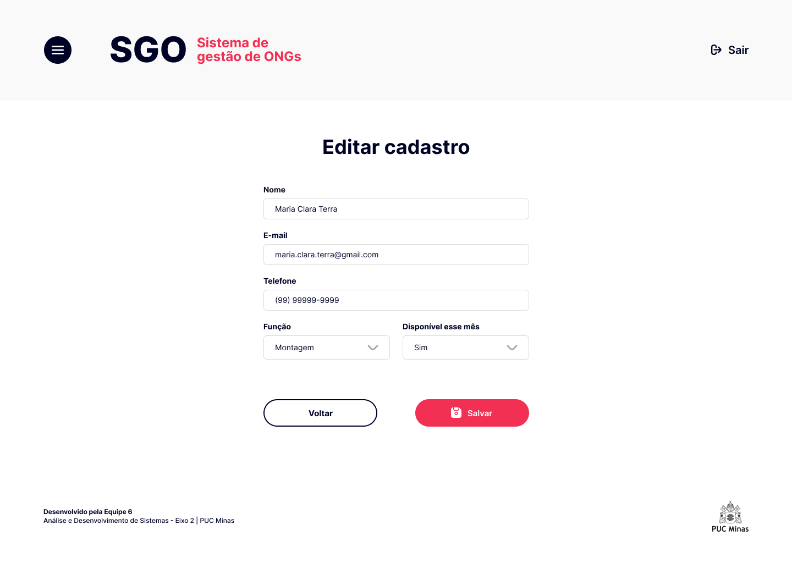

- Detalhes no Cadastro de Voluntário

Essa tela permite ao gestor visualizar todas as informações de cadastro do respectivo voluntário. Além disso, a tela possui os botões de “Editar” e “Voltar”. 

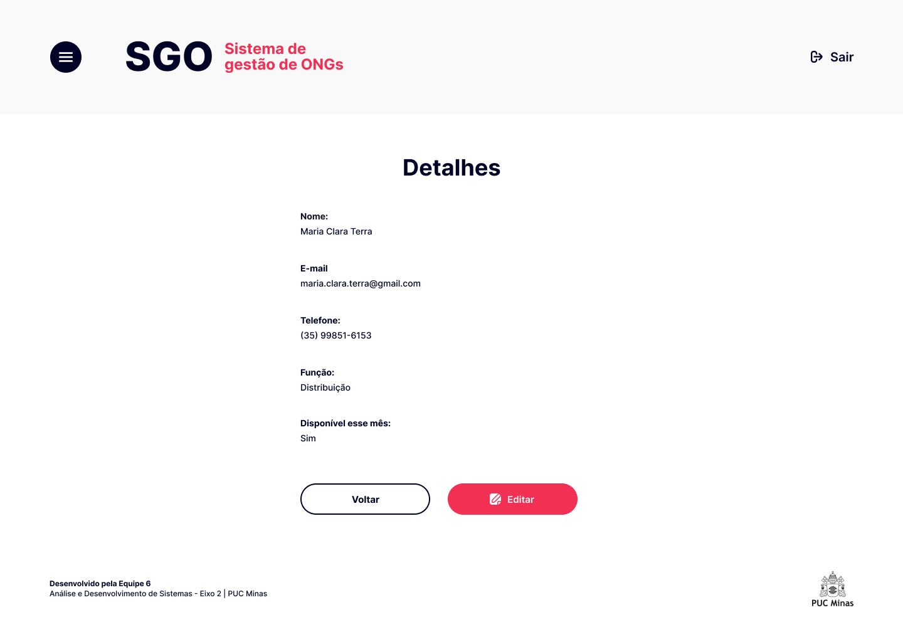

- Excluir Cadastro do Voluntário

Essa tela permite que o gestor realize a exclusão de um voluntário da base de dados do sistema. Para isso, ele deverá preencher os campos e clicar em excluir.  Caso queira desistir, basta clicar em “voltar”. 

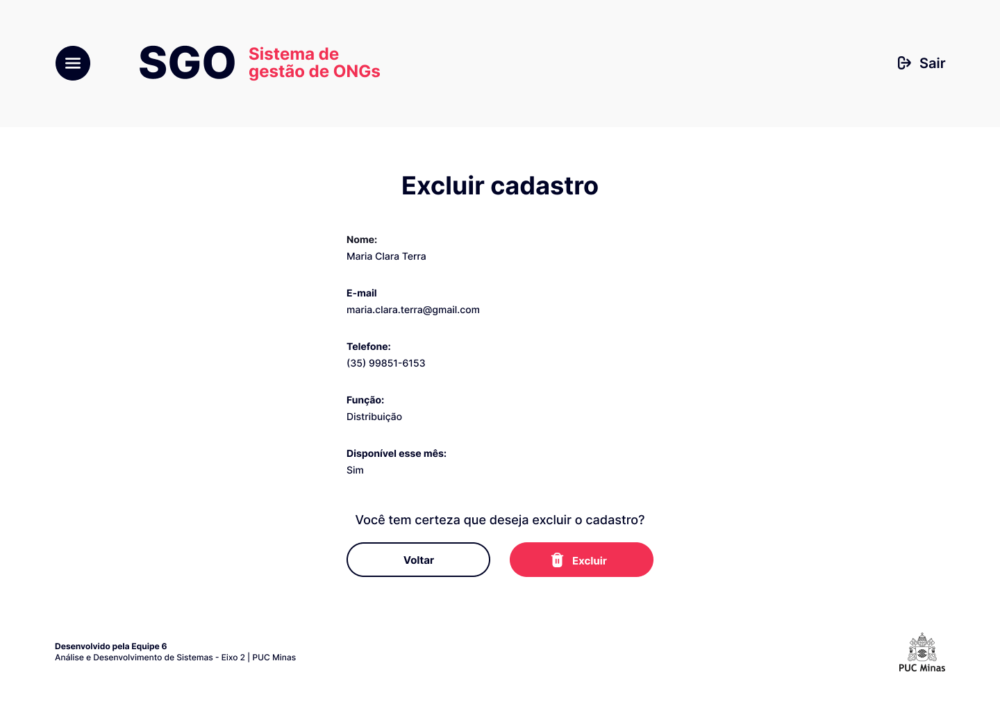

- Cadastro de Doadores

A tela seguinte permite ao gestor realizar o cadastro de um doador. Para isso, ele deverá preencher os campos com as informações requisitadas e clicar em “cadastrar”. 

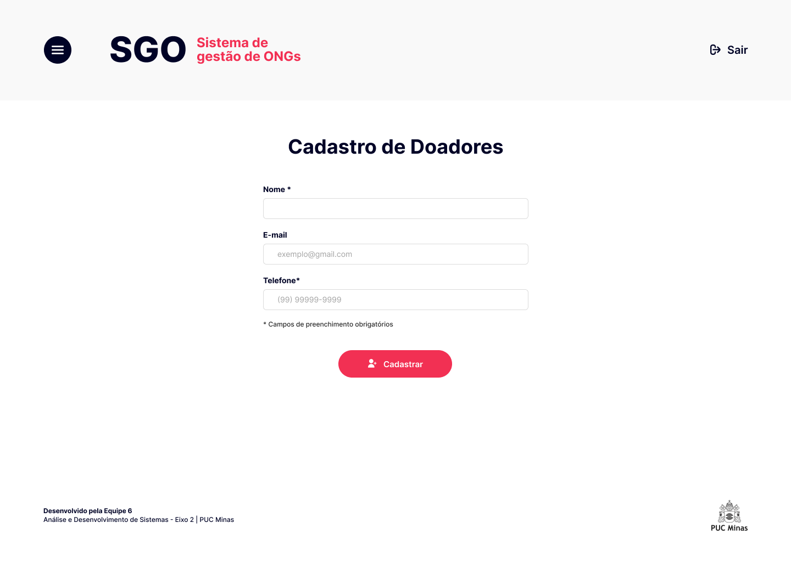

- Lista de Doadores

Realizado o cadastro do doador, o gestor poderá visualizar  suas informações (como nome, telefone e e-mail) em uma lista. Esse é o objetivo da tela abaixo, que também conta com botões para edição, exclusão e visualização de detalhes do cadastro do respectivo doador.

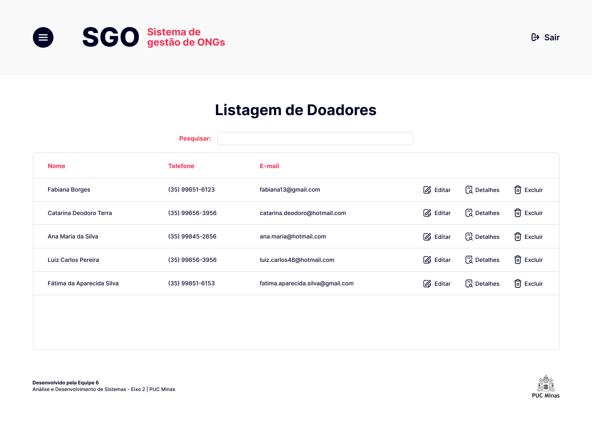

- Editar Cadastro do Doador

Essa tela permite ao gestor a realização da edição do cadastro de um doador. Para isso, ele deverá preencher os campos e clicar em salvar. Caso queira desistir, basta clicar em “voltar”. 

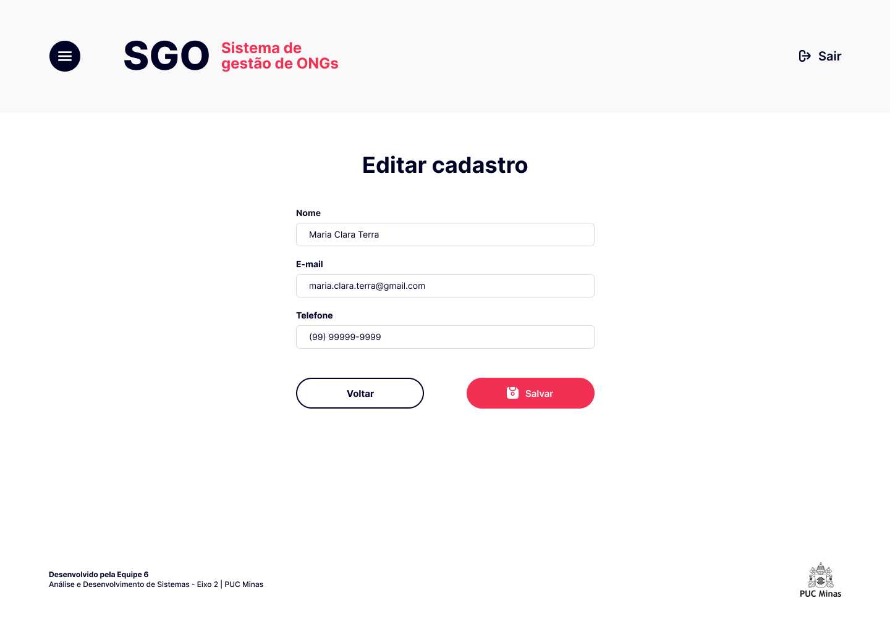

- Detalhes no Cadastro do Doador

Essa tela permite ao gestor visualizar todas as informações de cadastro do respectivo doador. Além disso, a tela possui os botões de “Editar” e “Voltar”. 

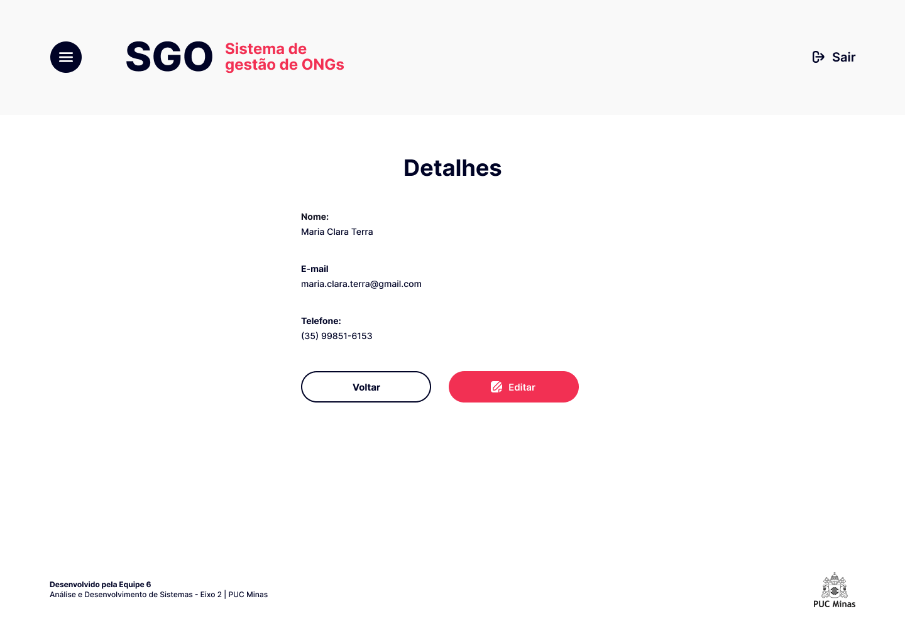

- Excluir Cadastro do Doador

Essa tela permite que o gestor realize a exclusão de um doador da base de dados do sistema. Para isso, ele deverá preencher os campos e clicar em excluir. Caso queira desistir, basta clicar em “voltar”. 

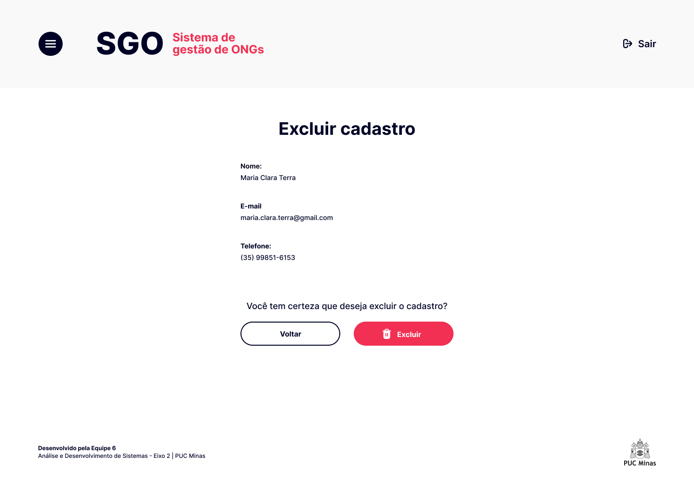

- Suporte

A tela de suporte possui as informações necessárias para que o gestor entre em contato com os desenvolvedores da aplicação. 

