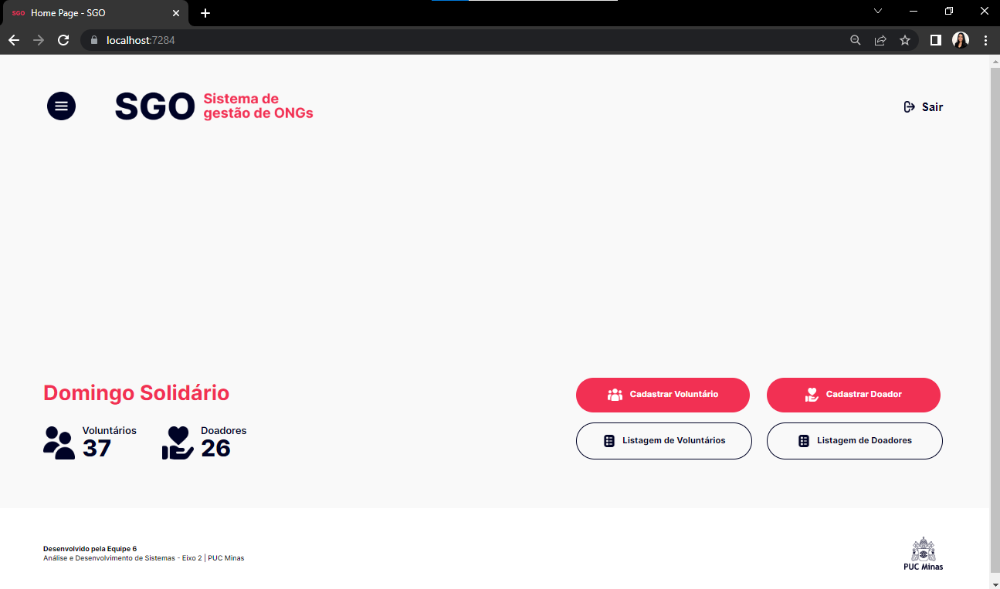
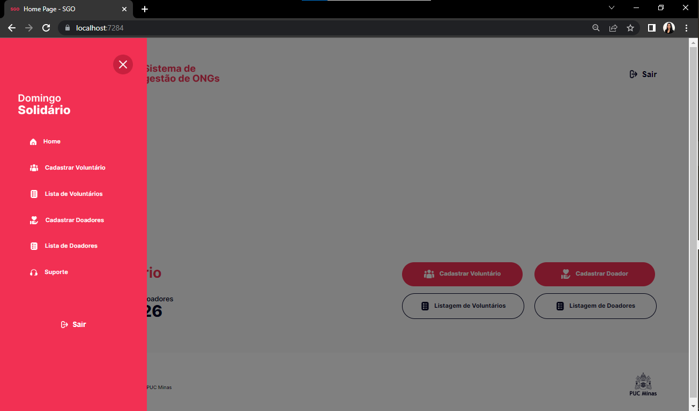
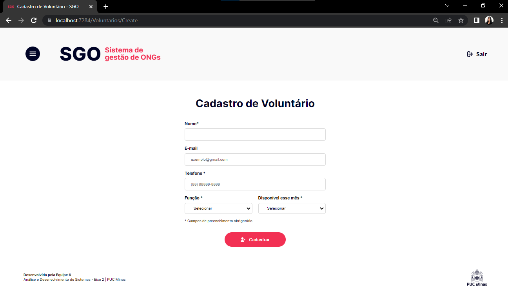
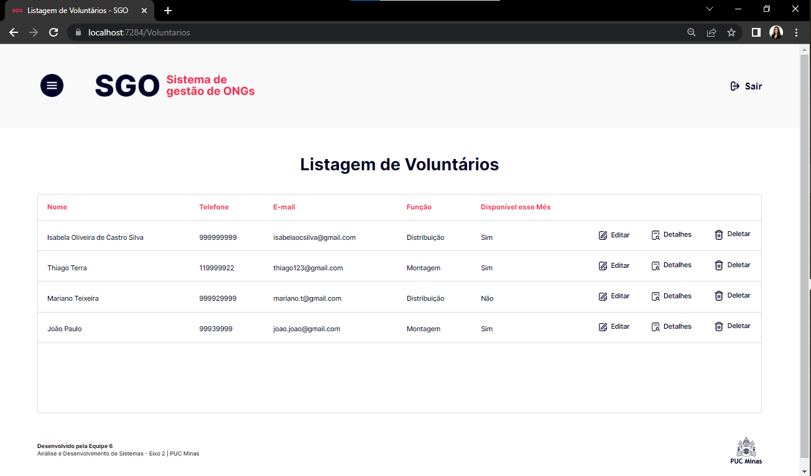
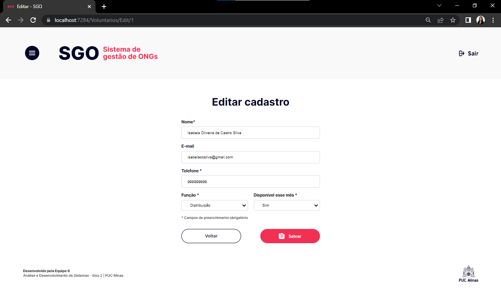
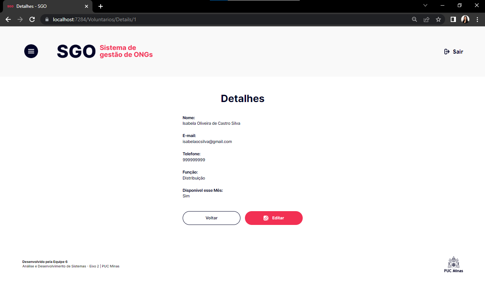
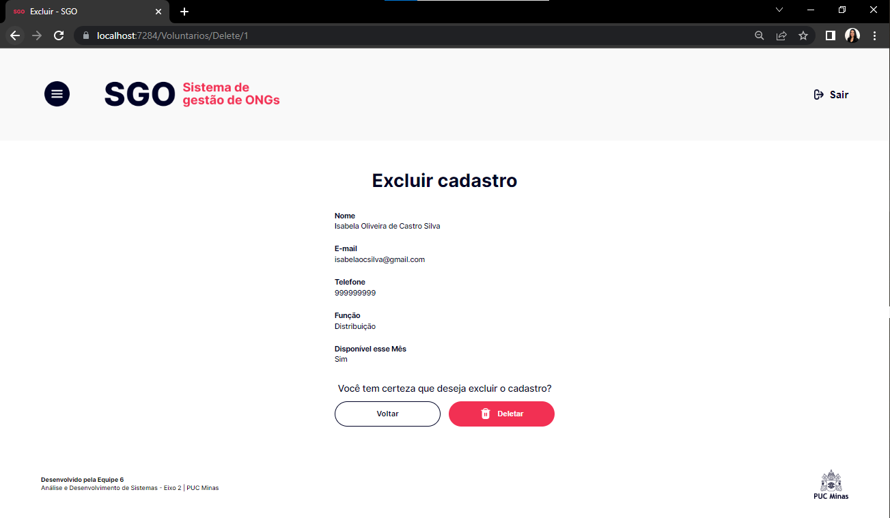

# Programação de Funcionalidades

# Home

## Requisitos Atendidos: 

- RF-02: O sistema deve ter uma tela de home com a opção de cadastro de voluntários e doadores. 

- RF-03: A tela de home deve ter um botão para acessar a lista de voluntários e a lista de doadores cadastrados. 

- RF-13: O site deve ter em sua home a quantidade de voluntários e doadores cadastrados. 
## Artefatos da funcionalidade:

- abrir-navbar.png; 

- fechar-navbar.png; 

- home-navbar.png; 

- listas-home.png; 

- listas-navbar.png; 

- logo-navbar-domSolidario.png; 

- logo-puc.png; 

- logo-sgo.png; 

- sair-header.png; 

- total-doadores.png; 

- total-voluntarios.png; 

- cabecalho.css 

- rodape.css 

- home.css 

- navbar.css 

- base.css 

- reset.css 

- home.cshtml 

## Instruções de acesso:

- Abra o navegador de internet e acesse o site: https://domingosolidario.azurewebsites.net/;

- Você será redirecionado para a Home.

# Cadastro de Voluntários

## Requisitos Atendidos:

- RF-04: O site deve conter, no momento do cadastro dos voluntários, os campos para preenchimento: Nome, Telefone, E-mail, disponibilidade para atuação no mês e função a qual o voluntário deseja no dia da ação: montagem ou distribuição. 

## Artefatos da funcionalidade:

- abrir-navbar.png; 

- botao-cadastrar.png; 

- logo-puc.png; 

- logo-sgo.png; 

- sair-header.png; 

- cabecalho.css 

- rodape.css 

- cadastro-voluntario.css 

- navbar.css 

- base.css 

- reset.css 

- validacoes.css 

- Create.cshtml 
## Instruções de acesso:

- Abra o navegador de internet e acesse o site: https://domingosolidario.azurewebsites.net/;

- Para acessar a tela de cadastro de voluntário, basta clicar em “Cadastrar Voluntário”. 
# Lista de Voluntários

## Requisitos Atendidos:

- RF-05: A lista de voluntários é formada pelos campos preenchidos no cadastro dos voluntários e conterá um botão para edição, exclusão e visualização dos detalhes dos dados cadastrados. 

## Artefatos da funcionalidade:

- abrir-navbar.png; 

- botao-detalhes-lista.png; 

- botao-editar.png; 

- botao-excluir-lista.png; 

- logo-puc.png; 

- logo-sgo.png; 

- sair-header.png; 

- cabecalho.css 

- rodape.css 

- lista-voluntarios.css 

- navbar.css 

- base.css 

- reset.css 

- Index.cshtml 
## Instruções de acesso:
- Abra o navegador de internet e acesse o site: https://domingosolidario.azurewebsites.net/;

- Para acessar a tela de listagem de voluntários, basta clicar em “Listagem de Voluntários” ou acessar a lista pela navbar. 

# Edição de Cadastro de Voluntários

## Requisitos Atendidos:

- RF-06: O sistema deve permitir ao gestor alterar os dados cadastrais do voluntário. 

## Artefatos da funcionalidade:

- abrir-navbar.png; 

- botao-salvar.png; 

- logo-puc.png; 

- logo-sgo.png; 

- sair-header.png; 

- cabecalho.css 

- rodape.css 

- cadastro-voluntario.css 

- navbar.css 

- base.css 

- reset.css 

- validacoes.css 

- Edit.cshtml 

## Instruções de acesso:

- Abra o navegador de internet e acesse o site: https://domingosolidario.azurewebsites.net/ 

- Para acessar a tela de edição, basta acessar a lista de voluntários e clicar em “Editar”. 

# Detalhes no Cadastro de Voluntários

## Requisitos Atendidos:

- RF-05: A lista de voluntários é formada pelos campos preenchidos no cadastro dos voluntários e conterá um botão para edição, exclusão e visualização dos detalhes dos dados cadastrados. 

## Artefatos da funcionalidade:

- abrir-navbar.png; 

- botao-editar.png; 

- logo-puc.png; 

- logo-sgo.png; 

- sair-header.png; 

- cabecalho.css 

- rodape.css 

- cadastro-voluntario.css 

- navbar.css 

- base.css 

- reset.css 

- Details.cshtml 
## Instruções de acesso:

- Abra o navegador de internet e acesse o site: https://domingosolidario.azurewebsites.net/ 

- Para acessar a tela de detalhes, basta acessar a lista de voluntários e clicar em “Detalhes”. 
# Excluir Cadastro de Voluntários

## Requisitos Atendidos:

- RF-07: O sistema deve permitir ao gestor excluir o voluntário cadastrado. 
## Artefatos da funcionalidade:

- abrir-navbar.png; 

- botao-excluir.png; 

- logo-puc.png; 

- logo-sgo.png; 

- sair-header.png; 

- cabecalho.css 

- rodape.css 

- cadastro-voluntario.css 

- navbar.css 

- base.css 

- reset.css 

- Delete.cshtml 

## Instruções de acesso:

- Abra o navegador de internet e acesse o site: https://domingosolidario.azurewebsites.net/ 

- Para acessar a tela de exclusão de cadastro, basta acessar a lista de voluntários e clicar em “Deletar”. 

