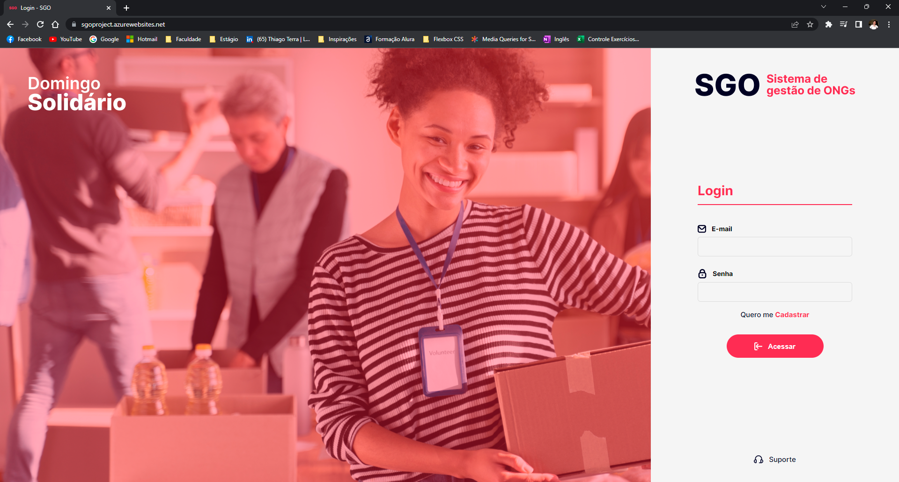
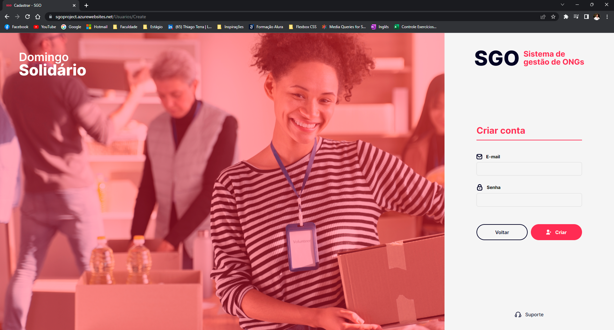
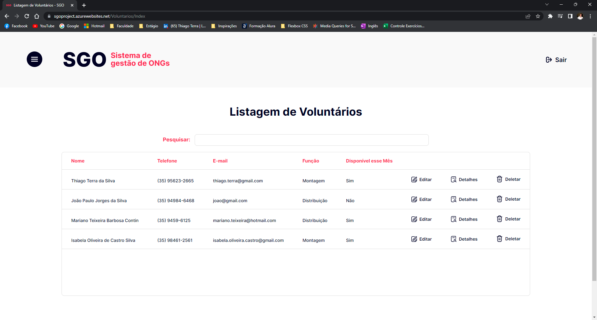
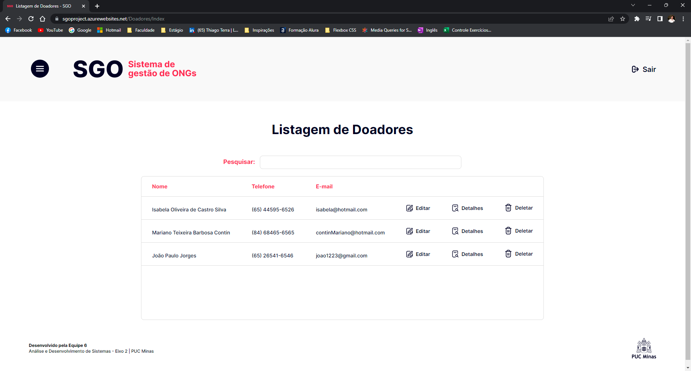
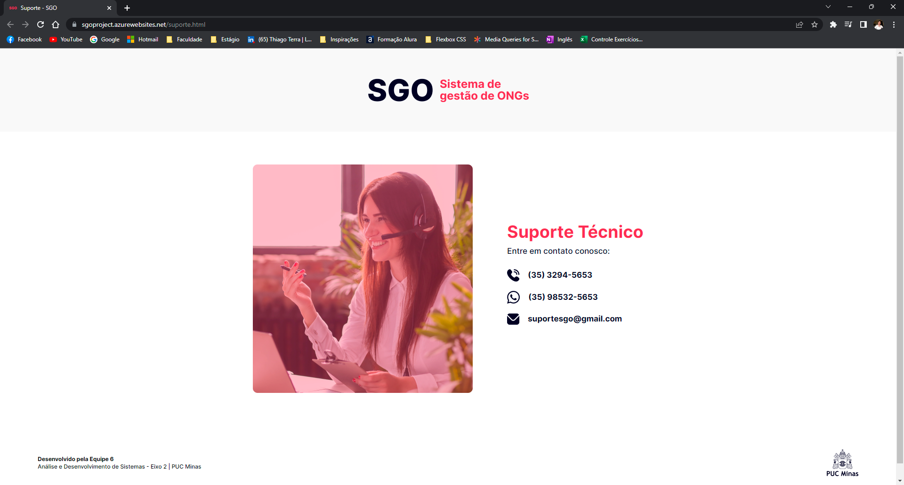

# Programação de Funcionalidades

Nesta seção são apresentadas as telas desenvolvidas pelo grupo para cada uma das funcionalidades do sistema.

# Login

## Requisitos Atendidos:

- RF-02: O sistema deve ter uma tela para o gestor realizar login, com os seguintes campos de preenchimento: E-mail e senha. 

## Artefatos da funcionalidade:

- logo-sgo.png; 

- logo-login-domSolidário.png 

- imagem-login.png 

- email-login.png 

- senha-login.png 

- acessar-login.png 

- suporte-login.png 

- base.css 

- reset.css 

- login.css 

- validacoes.css 

- Login.cshtml 

## Instruções de acesso:

- Abra o navegador de internet e acesse o site: https://sgodomingosolidario.azurewebsites.net/

- A primeira página exibida é a tela de login.  

# Cadastro de usuário

## Requisitos Atendidos:

- RF-01: O sistema deve ter uma tela para o gestor realizar o seu cadastro, com os seguintes campos de preenchimento: E-mail e senha. 

## Artefatos da funcionalidade:

- logo-sgo.png; 

- logo-login-domSolidário.png 

- email-login.png 

- senha-login.png 

- acessar-login.png 

- suporte-login.png 

- base.css 

- reset.css 

- login.css 

- validacoes.css 

- Create.cshtml 

## Instruções de acesso:

- Abra o navegador de internet e acesse o site: https://sgodomingosolidario.azurewebsites.net/

- A primeira página exibida é a tela de login;

- Clique em “quero me cadastrar” para ser redirecionado para a tela de cadastro. 

# Home

## Requisitos Atendidos: 

- RF-03: O sistema deve ter uma tela de home com a opção de cadastro de voluntários e doadores. 

- RF-04: A tela de home deve ter um botão para acessar a lista de voluntários e a lista de doadores cadastrados. 

- RF-16: O site deve ter em sua home a quantidade de voluntários e doadores cadastrados. 

## Artefatos da funcionalidade:

- abrir-navbar.png; 

- fechar-navbar.png; 

- home-navbar.png; 

- listas-home.png; 

- listas-navbar.png; 

- logo-navbar-domSolidario.png; 

- logo-puc.png; 

- logo-sgo.png; 

- sair-header.png; 

- total-doadores.png; 

- total-voluntarios.png; 

- cabecalho.css 

- rodape.css 

- home.css 

- navbar.css 

- base.css 

- reset.css 

- home.cshtml 

## Instruções de acesso:

- Abra o navegador de internet e acesse o site: https://sgodomingosolidario.azurewebsites.net/

- Realize o login com seu E-mail e Senha; 

- Após realizar o login, você será redirecionado para a Home. 

# Cadastro de Voluntário

## Requisitos Atendidos:

- RF-05: O site deve conter, no momento do cadastro dos voluntários, os campos para preenchimento: Nome, Telefone, E-mail, disponibilidade para atuação no mês e função a qual o voluntário deseja no dia da ação: montagem ou distribuição. 

## Artefatos da funcionalidade:

- abrir-navbar.png; 

- botao-cadastrar.png; 

- logo-puc.png; 

- logo-sgo.png; 

- sair-header.png; 

- cabecalho.css 

- rodape.css 

- cadastro-voluntario.css 

- navbar.css 

- base.css 

- reset.css 

- validacoes.css 

- Create.cshtml 
## Instruções de acesso:

- Abra o navegador de internet e acesse o site: https://sgodomingosolidario.azurewebsites.net/

- A primeira página exibida é a tela de login; 

- Para acessar a tela de cadastro de voluntário, basta clicar em “Cadastrar Voluntário”. 

# Lista de Voluntários

## Requisitos Atendidos:

- RF-06: A lista de voluntários é formada pelos campos preenchidos no cadastro dos voluntários e conterá um botão para edição, exclusão e visualização dos detalhes dos dados cadastrados. 

## Artefatos da funcionalidade:

- abrir-navbar.png; 

- botao-detalhes-lista.png; 

- botao-editar.png; 

- botao-excluir-lista.png; 

- logo-puc.png; 

- logo-sgo.png; 

- sair-header.png; 

- cabecalho.css 

- rodape.css 

- lista-voluntarios.css 

- navbar.css 

- base.css 

- reset.css 

- Index.cshtml 

## Instruções de acesso:
- Abra o navegador de internet e acesse o site: https://sgodomingosolidario.azurewebsites.net/

- A primeira página exibida é a tela de login; 

- Para acessar a tela de listagem de voluntários, basta clicar em “Listagem de Voluntários” ou acessar a lista pela navbar. 

# Edição de Cadastro de Voluntários

## Requisitos Atendidos:

- RF-07: O sistema deve permitir ao gestor alterar os dados cadastrais do voluntário. 

## Artefatos da funcionalidade:

- abrir-navbar.png; 

- botao-salvar.png; 

- logo-puc.png; 

- logo-sgo.png; 

- sair-header.png; 

- cabecalho.css 

- rodape.css 

- cadastro-voluntario.css 

- navbar.css 

- base.css 

- reset.css 

- validacoes.css 

- Edit.cshtml 

## Instruções de acesso:

- Abra o navegador de internet e acesse o site: https://sgodomingosolidario.azurewebsites.net/

- A primeira página exibida é a tela de login; 

- Para acessar a tela de edição, basta acessar a lista de voluntários e clicar em “Editar”. 

# Detalhes no Cadastro de Voluntários

## Requisitos Atendidos:

- RF-06: A lista de voluntários é formada pelos campos preenchidos no cadastro dos voluntários e conterá um botão para edição, exclusão e visualização dos detalhes dos dados cadastrados. 

## Artefatos da funcionalidade:

- abrir-navbar.png; 

- botao-editar.png; 

- logo-puc.png; 

- logo-sgo.png; 

- sair-header.png; 

- cabecalho.css 

- rodape.css 

- cadastro-voluntario.css 

- navbar.css 

- base.css 

- reset.css 

- Details.cshtml 

## Instruções de acesso:

- Abra o navegador de internet e acesse o site: https://sgodomingosolidario.azurewebsites.net/

- A primeira página exibida é a tela de login; 

- Para acessar a tela de detalhes, basta acessar a lista de voluntários e clicar em “Detalhes”. 
# Excluir Cadastro de Voluntários

## Requisitos Atendidos:

- RF-08: O sistema deve permitir ao gestor excluir o voluntário cadastrado.

## Artefatos da funcionalidade:

- abrir-navbar.png; 

- botao-excluir.png; 

- logo-puc.png; 

- logo-sgo.png; 

- sair-header.png; 

- cabecalho.css 

- rodape.css 

- cadastro-voluntario.css 

- navbar.css 

- base.css 

- reset.css 

- Delete.cshtml 

## Instruções de acesso:

- Abra o navegador de internet e acesse o site: https://sgodomingosolidario.azurewebsites.net/

- A primeira página exibida é a tela de login;  

- Para acessar a tela de exclusão de cadastro, basta acessar a lista de voluntários e clicar em “Deletar”. 

## Cadastro de Doador

## Requisitos Atendidos:

- RF-10: A tela de cadastro de doadores deve conter os seguintes campos para preenchimento: Nome, Telefone e E-mail. 

## Artefatos da funcionalidade:

- abrir-navbar.png; 

- botao-cadastrar.png; 

- logo-puc.png; 

- logo-sgo.png; 

- sair-header.png; 

- cabecalho.css 

- rodape.css 

- cadastro-doador.css 

- navbar.css 

- base.css 

- reset.css 

- validacoes.css 

- Create.cshtml 

## Instruções de acesso:

- Abra o navegador de internet e acesse o site: https://sgodomingosolidario.azurewebsites.net/

- A primeira página exibida é a tela de login; 

- Para acessar a tela de cadastro de doadores, basta clicar em “Cadastrar Doador”. 

## Lista de Doadores

## Requisitos Atendidos:

- RF-11: A lista de doadores é formada pelos campos preenchidos no cadastro dos doadores e conterá um botão para edição, exclusão e visualização dos detalhes dos dados cadastrados.   

## Artefatos da funcionalidade:

- abrir-navbar.png; 

- botao-detalhes-lista.png; 

- botao-editar.png; 

- botao-excluir-lista.png; 

- logo-puc.png; 

- logo-sgo.png; 

- sair-header.png; 

- cabecalho.css 

- rodape.css 

- lista-doadores.css 

- navbar.css 

- base.css 

- reset.css 

- validacoes.css 

- Index.cshtml 
## Instruções de acesso:

- Abra o navegador de internet e acesse o site: https://sgodomingosolidario.azurewebsites.net/

- A primeira página exibida é a tela de login; 

- Para acessar a tela de listagem de doadores, basta clicar em “Listagem de Doadores” ou acessar a lista pela navbar. 

## Edição de cadastro de doador

## Requisitos Atendidos:
- RF-12: O sistema deve permitir ao gestor alterar os dados cadastrais do doador. 

## Artefatos da funcionalidade:

- abrir-navbar.png; 

- botao-salvar.png; 

- logo-puc.png; 

- logo-sgo.png; 

- sair-header.png; 

- cabecalho.css 

- rodape.css 

- cadastro-doador.css 

- navbar.css 

- base.css 

- reset.css 

- validacoes.css 

- Edit.cshtml 

## Instruções de acesso:

- Abra o navegador de internet e acesse o site: https://sgodomingosolidario.azurewebsites.net/

- A primeira página exibida é a tela de login; 

- Para acessar a tela de edição, basta acessar a lista de doadores e clicar em “Editar”. 

## Detalhes no Cadastro do Doador

## Requisitos Atendidos:

- RF-11: A lista de doadores é formada pelos campos preenchidos no cadastro dos doadores e conterá um botão para edição,exclusão e visualização dos detalhes dos dados cadastrados.   

## Artefatos da funcionalidade:

- abrir-navbar.png; 

- botao-editar.png; 

- logo-puc.png; 

- logo-sgo.png; 

- sair-header.png; 

- cabecalho.css 

- rodape.css 

- cadastro-doador.css 

- navbar.css 

- base.css 

- reset.css 

- Details.cshtml 

## Instruções de acesso:
 
- Abra o navegador de internet e acesse o site: https://sgodomingosolidario.azurewebsites.net/

- A primeira página exibida é a tela de login; 

- Para acessar a tela de detalhes, basta acessar a lista de doadores e clicar em “Detalhes”. 

## Excluir cadastro de doador

## Requisitos Atendidos:

- RF-13: O sistema deve permitir ao gestor excluir o doador cadastrado. 

## Artefatos da funcionalidade:

- abrir-navbar.png; 

- botao-excluir.png; 

- logo-puc.png; 

- logo-sgo.png; 

- sair-header.png; 

- cabecalho.css 

- rodape.css 

- cadastro-doador.css 

- navbar.css 

- base.css 

- reset.css 

- Delete.cshtml 

## Instruções de acesso:

- Abra o navegador de internet e acesse o site: https://sgodomingosolidario.azurewebsites.net/

- A primeira página exibida é a tela de login;  

- Para acessar a tela de exclusão de cadastro, basta acessar a lista de doadores e clicar em “Deletar” 

## Suporte

## Requisitos Atendidos:

- RF-15: O sistema deve ter uma tela com opções para contactar o suporte técnico.   
## Artefatos da funcionalidade:

- logo-sgo.png 

- imagem-suporte.png 

- telefonica-suporte.png 

- whatsapp-suporte.png 

- email-suporte.png 

- logo-puc.png 

- rodape.css 

- base.css 

- reset.css 

- suporte.css 

- suporte.html 

## Instruções de acesso:

- Abra o navegador de internet e acesse o site: https://sgodomingosolidario.azurewebsites.net/

- A primeira página exibida é a tela de login; 

- Para acessar a tela de suporte, basta clicar na opção “suporte” exibida na tela de login ou na navbar. 