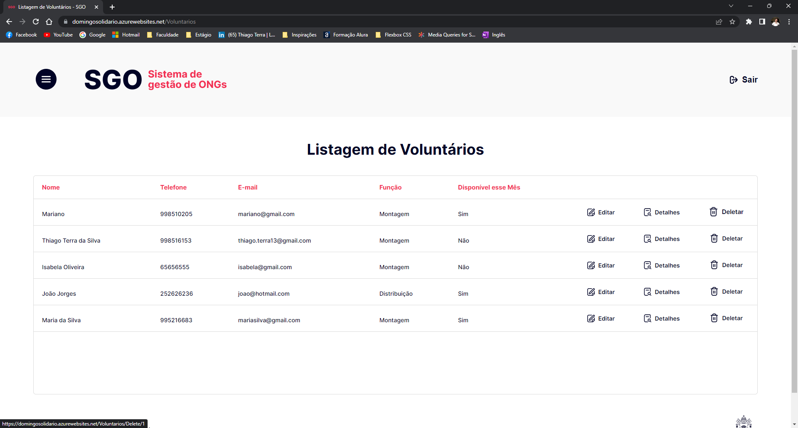

# Registro de Testes de Software

Nesta seção constam os registros fotográficos dos testes descritos nos casos do tópico anterior.

## CT-02 – Cadastro de voluntários 
- Nessa tela, preenchemos os campos para realização do cadastro e clicamos na opção “cadastrar”; 

- Feito o cadastro, o usuário foi redirecionado para Listagem de Voluntários e o voluntários cadastrado consta na lista; 

 

## CT-03 – Cadastro de doadores 
- Nessa tela, preenchemos os campos para realização do cadastro e clicamos na opção “cadastrar”; 

- Feito o cadastro, o usuário foi redirecionado para Listagem de Doadores e o doador cadastrado consta na lista; 

 
## CT-04 – Acessar lista de voluntários cadastrados   
- Nessa tela, clicamos na opção “Listagem de Voluntários”; 

- O usuário foi redirecionado para a lista de voluntários. 

## CT-05 – Acessar lista de doadores cadastrados   
- Nessa tela, clicamos na opção “Listagem de Doadores”; 

- O usuário foi redirecionado para a lista de doadores. 

 

## CT-06 – Editar as informações de cadastro do voluntário   
- Nessa tela, clicamos na opção de edição; 

- O usuário foi redirecionado para a tela de edição. Seguimos preenchendo os campos a serem editados e clicando em “salvar”; 

- Ao clicar em salvar, os novos dados constam na lista de voluntários. 

 

## CT-07 – Editar as informações de cadastro do doador 
- Nessa tela, clicamos na opção de edição; 

- O usuário foi redirecionado para a tela de edição. Seguimos preenchendo os campos a serem editados e clicando em “salvar”; 

- Ao clicar em salvar, os novos dados constam na lista de doadores. 

 

## CT-08 – Excluir voluntário   
- Nessa tela, clicamos na opção de excluir; 

- O usuário foi redirecionado para a tela de exclusão. Seguimos acionando o botão “excluir”; 

 
- O usuário foi redirecionado para a lista de voluntários e cadastro excluído não consta mais na lista.

 
## CT-09 – Excluir doador 
- Nessa tela, clicamos na opção de excluir; 

 
- O usuário foi redirecionado para a tela de exclusão. Seguimos acionando o botão “excluir”; 

 
- O usuário foi redirecionado para a lista de doadores e cadastro excluído não consta mais na lista. 

