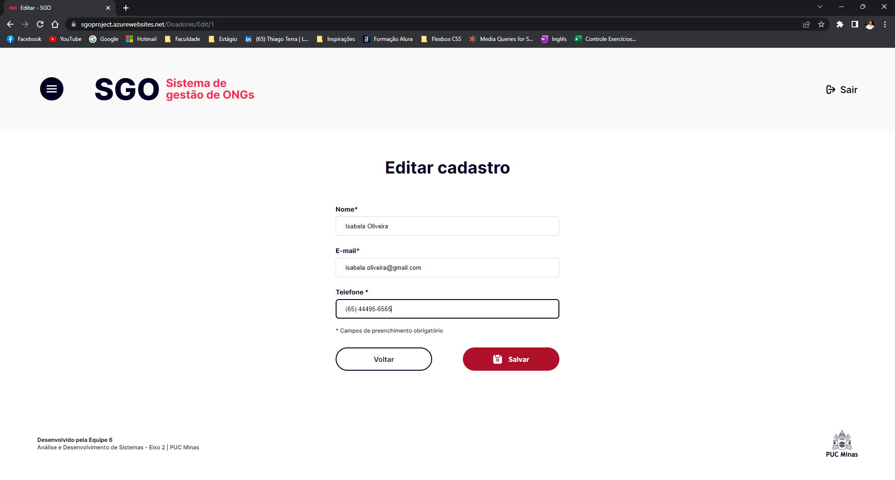

# Registro de Testes de Software

Nesta seção constam os registros fotográficos dos testes descritos nos casos do tópico anterior.

## CT-01 – Cadastro 
- Na tela de cadastro, inserimos e-mail e senha e clicamos na opção “criar”;  

- O usuário foi redirecionado para a tela de login.

 
## CT-02 – Login
- Nessa tela, entramos com e-mail e senha e clicamos na opção de “acessar”; 

- O usuário foi redirecionado para a tela “home”. 

## CT-03 – Cadastro de voluntários 
- Nessa tela, preenchemos os campos para realização do cadastro e clicamos na opção “cadastrar”; 

- Feito o cadastro, o usuário foi redirecionado para Listagem de Voluntários e os voluntários cadastrados constm na lista; 

 

## CT-04 – Cadastro de doadores 
- Nessa tela, preenchemos os campos para realização do cadastro e clicamos na opção “cadastrar”; 

- Feito o cadastro, o usuário foi redirecionado para Listagem de Doadores e o doador cadastrado consta na lista; 

 
## CT-05 – Acessar lista de voluntários cadastrados   
- Nessa tela, clicamos na opção “Listagem de Voluntários”; 

- O usuário foi redirecionado para a lista de voluntários. 

## CT-06 – Acessar lista de doadores cadastrados   
- Nessa tela, clicamos na opção “Listagem de Doadores”; 

- O usuário foi redirecionado para a lista de doadores. 

 

## CT-07 – Editar as informações de cadastro do voluntário   
- Nessa tela, clicamos na opção de edição; 

- O usuário foi redirecionado para a tela de edição. Seguimos preenchendo os campos a serem editados e clicando em “salvar”; 

- Ao clicar em salvar, os novos dados constam na lista de voluntários. 

 

## CT-08 – Editar as informações de cadastro do doador 
- Nessa tela, clicamos na opção de edição; 

- O usuário foi redirecionado para a tela de edição. Seguimos preenchendo os campos a serem editados e clicando em “salvar”; 

- Ao clicar em salvar, os novos dados constam na lista de doadores. 

 

## CT-09 – Excluir voluntário   
- Nessa tela, clicamos na opção de excluir; 

- O usuário foi redirecionado para a tela de exclusão. Seguimos acionando o botão “excluir”; 

- O usuário foi redirecionado para a lista de voluntários e cadastro excluído não consta mais na lista.

 
## CT-10 – Excluir doador 
- Nessa tela, clicamos na opção de excluir; 

- O usuário foi redirecionado para a tela de exclusão. Seguimos acionando o botão “excluir”; 

- O usuário foi redirecionado para a lista de doadores e cadastro excluído não consta mais na lista. 

## CT-11 – Pesquisar voluntário
- Nessa tela, inserimos o nome de determinado voluntário na barra de pesquisa;  

- Feita a pesquisa, o voluntário consta na listagem abaixo.  

## CT-12 – Pesquisar doador
- Nessa tela, inserimos o nome de determinado doador na barra de pesquisa;  

- Feita a pesquisa, o doador consta na listagem abaixo.  

## CT-13 – Acesso a tela de suporte técnico 
- Nessa tela clicamos na opção “suporte”, no menu hamburguer; 

- O sistema redireciona para a tela de suporte. 

## CT-14 – Visualização da quantidade de doadores e voluntários na homepage 
- Nessa tela, é possível visualizar, no canto inferior esquerdo a quantidade de voluntários e doadores cadastrados no sistema. 

